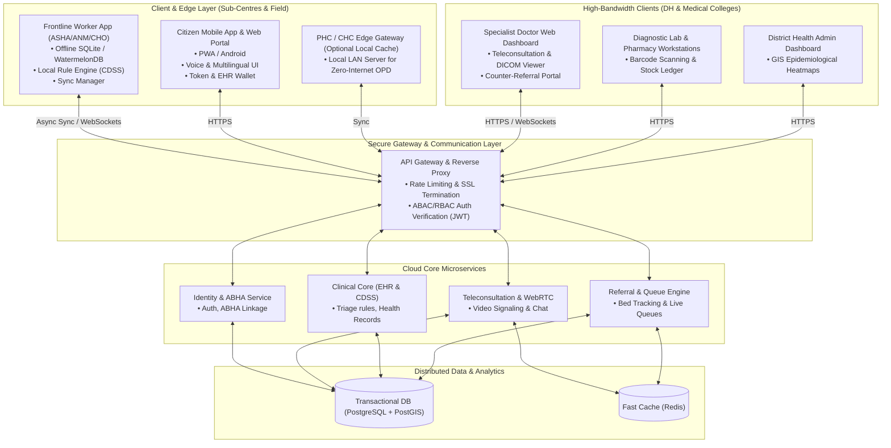

# Rural Public Healthcare Platform (SIH26133)

An offline-resilient, tiered healthcare platform designed for rural India, addressing the extreme variations in digital infrastructure (from zero-connectivity tribal hamlets to high-speed fiber at District Hospitals). 

This platform empowers frontline healthcare workers (ASHAs, ANMs, CHOs) with offline-first mobile applications, local Clinical Decision Support Systems (CDSS), and seamless teleconsultation capabilities with specialists at Primary Health Centres (PHCs) and District Hospitals (DHs).

## Features
* **Offline-First Resilience**: Work offline at sub-centres and sync automatically when internet is available.
* **Triage & CDSS**: AI-assisted rule engines for maternal and pediatric screening.
* **Teleconsultation**: Seamless WebRTC-based video consultations bridging rural patients and urban specialists.
* **Robust RBAC**: Secure role-based access control for Citizens, ASHAs, Doctors, Lab Techs, and Admins.
* **Multilingual UI**: Accessible interface supporting regional languages.

## 🏗 System Architecture

The platform utilizes a **Local-First, Distributed, Tiered Architecture**:



## Tech Stack
* **Frontend**: React, TypeScript, Vite, Tailwind CSS (v4)
* **Backend**: Node.js (v24), Express, TypeScript, `tsx`
* **Database**: PostgreSQL (Docker), PostGIS, Redis (currently utilizing SQLite for active local dev phase)
* **Testing**: Vitest, Supertest

## Getting Started

```bash
# 1. Install dependencies at root, frontend, and backend
npm install
cd frontend && npm install
cd ../backend && npm install

# 2. Set up environment variables
# Copy .env configuration as needed in the backend/ folder

# 3. Start development servers concurrently
npm run dev
```

Detailed architectural blueprints, requirement matrices, and project state documents can be found in the `/docs` directory.
