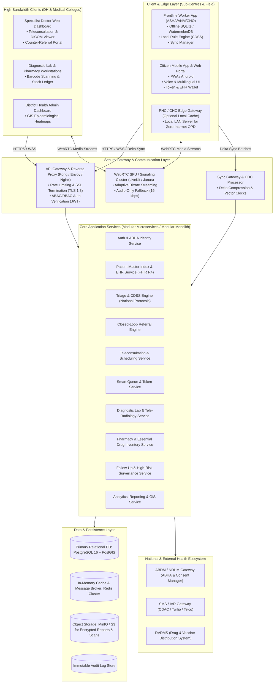
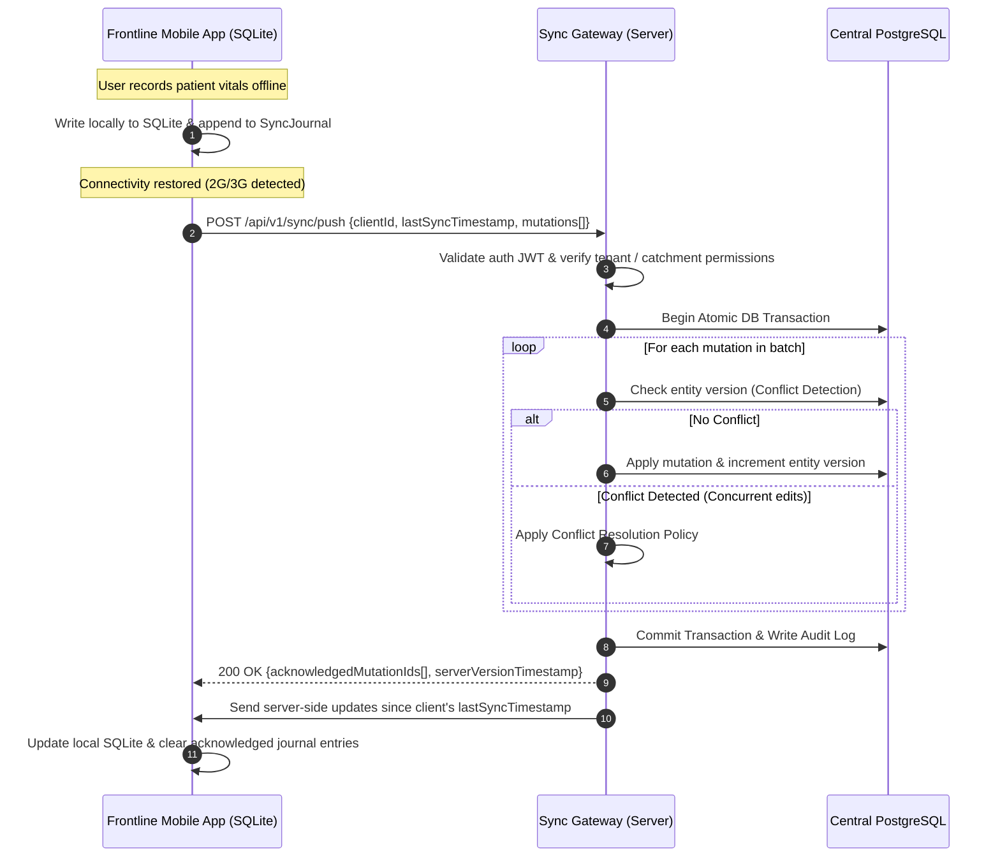
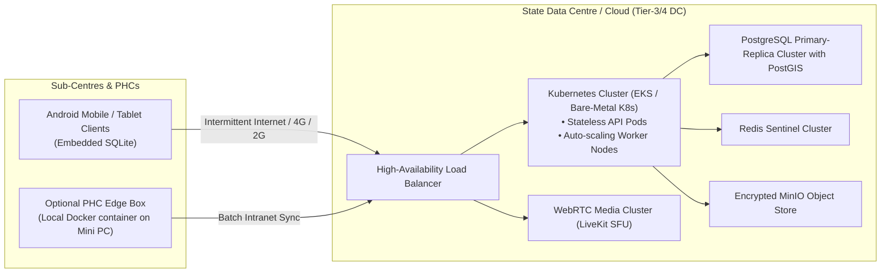

# System Architecture & Technical Design: Rural Public Healthcare Platform

**Project Code:** SIH26133  
**Document Version:** 1.0.0  
**Status:** Architectural Blueprint  

---

## 1. High-Level Architectural Overview

The platform is designed as a **Local-First, Distributed, Tiered Public Healthcare System**. It addresses the extreme variations in digital infrastructure across rural India (from zero-connectivity tribal hamlets to high-speed fiber at District Hospitals) through an offline-resilient edge-and-cloud architecture.

### 1.1 Architectural Topology Diagram

---

## 2. Offline-First & Low-Connectivity Architecture

### 2.1 The Problem in Rural Healthcare
Frontline workers in remote villages cannot rely on continuous internet connectivity. A nurse conducting an ante-natal checkup (ANC) in a mountain hamlet or forest settlement must never experience application freeze or data loss due to dropped cell signals.

### 2.2 Local-First Storage & Delta Synchronization Model
* **Local Embedded Database:**
  * Client mobile apps embed **SQLite** (via WatermelonDB or Room/SQLCipher) with AES-256 local database encryption.
  * All user actions (patient registrations, triage assessments, offline referral drafts, vital logs) are written synchronously to the local database first.
* **Mutation Journal & Vector Clocks:**
  * Every write creates a record in an append-only local `SyncJournal` with a monotonically increasing client sequence number, a UUID, a UTC timestamp, and a version hash.
* **Background Sync Manager:**
  * Using OS background job schedulers (`WorkManager` on Android, Service Workers on Web), the app listens to network state changes.
  * When connectivity (even 2G / GPRS) is detected, the `SyncManager` initiates a push-pull delta handshake.

### 2.3 Conflict Resolution Strategies
1. **Append-Only Clinical Observations:** Clinical entries (e.g., blood pressure measurements, prescription slips, notes) are immutable events. They are never overwritten; concurrent submissions create distinct timestamped records in the longitudinal record.
2. **Master Patient Demographic Edits:** Field-level Last-Write-Wins (LWW) utilizing server-authoritative timestamps, with high-privilege overrides (e.g., Medical Officer verification supercedes ASHA draft).
3. **Inventory & Slot Mutations:** Strictly non-optimistic. Medicine stock allocations and definitive appointment slots require server-side lock confirmations. While offline, appointments are stored as `Tentative_Offline_Requests` and confirmed once synced.

### 2.4 Bandwidth Optimization & Payload Budget
* **Delta Serialization:** Sync payloads use compressed JSON with Gzip/Brotli or Protocol Buffers (Protobuf).
* **Payload Size Constraint:** Sync requests are chunked to `< 50 KB` per HTTP request to ensure successful delivery on unstable 2G networks without socket timeouts.
* **Image Compression:** Clinical photos (e.g., skin lesions, eye pallor, paper reports) are downscaled and compressed to WebP format on the client before queuing for background upload.

---

## 3. Subsystems & Module Breakdown

### 3.1 Auth & Identity Subsystem (ABHA Integration)
* **Responsibilities:** Multi-tenant user authentication, ABHA number/address generation, Aadhaar OTP authentication, biometric authentication integration, and role-based session token management.
* **Key Components:**
  * OAuth2 / OpenID Connect provider.
  * ABDM Gateway Connector (M1, M2, M3 compliance).
  * JWT Token Issuer with embedded role and catchment area scopes (`facility_id`, `district_id`, `state_id`).

### 3.2 Longitudinal EHR & Patient Master Index (FHIR R4)
* **Responsibilities:** Manages unique patient identities, merges duplicate records, and maintains longitudinal health records compliant with HL7 FHIR R4 specifications.
* **Core FHIR Resources:**
  * `Patient`: Demographics, ABHA address, emergency contacts, socio-economic flags.
  * `Encounter`: Teleconsultation or physical visit episodes.
  * `Observation`: Vitals (BP, pulse, SpO2, blood sugar, weight, Hb).
  * `Condition`: Chronic illnesses, maternal risk status, active diagnoses (ICD-10 / SNOMED CT coded).
  * `MedicationRequest`: Structured electronic prescriptions.
  * `DiagnosticReport`: Lab test results, radiology imaging references.

### 3.3 Digital Triage & CDSS Subsystem
* **Responsibilities:** Automated clinical decision support applying national standard treatment guidelines (STGs) to incoming patient vitals and symptoms.
* **Engine Architecture:**
  * Client-side deterministic rule interpreter written in pure TypeScript/Kotlin (zero network dependencies).
  * Evaluates multi-parameter risk scores:
    * **High-Risk Pregnancy (HRP):** Evaluates systolic BP ≥ 140 or diastolic BP ≥ 90 (pre-eclampsia), Hb < 7 g/dL (severe anaemia), previous C-section, gestational diabetes.
    * **Pediatric Triage:** Fast breathing (>50/min), chest indrawing, stridor, severe wasting (MUAC < 115mm).
    * **NCD Cardiovascular Risk:** Blood glucose > 200 mg/dL, stage 2 hypertension.
  * Outputs standardized alert objects: `SEVERITY_RED` (Emergency/108 Ambulance), `SEVERITY_YELLOW` (Urgent Specialist Teleconsult/CHC visit within 48h), `SEVERITY_GREEN` (Routine Primary Follow-up).

### 3.4 Teleconsultation & Real-Time Communication (RTC) Subsystem
* **Responsibilities:** Manages both asynchronous (store-and-forward) and synchronous teleconsultations.
* **Components:**
  * **Signaling Server:** WebSocket-based room coordinator handling SDP offers/answers and ICE candidate exchange.
  * **Media Server (SFU):** Selective Forwarding Unit (e.g., LiveKit or Janus) enabling low-latency multi-party or peer-to-peer consultation between Patient, ASHA/CHO, and Doctor.
  * **Dynamic Bandwidth Fallback:** Continuous packet-loss monitoring. Automatically switches from Full HD (720p) -> SD (360p) -> Audio-Only (16kbps Opus) -> Offline Store-and-Forward audio clip upload.

### 3.5 Closed-Loop Referral Management Subsystem
* **Responsibilities:** Orchestrates the lifecycle of patient transfers across public health tiers.
* **Core Capabilities:**
  * Inter-facility capacity queries (bed availability, active specialist roster at target CHC/DH).
  * Structured referral bundle generation (patient clinical summary, reason for transfer, transport mode).
  * Target facility acknowledgement and pre-admission triage intake.
  * Two-way counter-referral mechanism: When the patient is discharged from the District Hospital, the specialist's counter-referral note is routed back to the initiating CHO/ASHA for rehabilitation and medication adherence follow-up.
  * Automated tracking of patient drop-outs with geo-targeted ASHA alerts.

### 3.6 Smart Queue & Dynamic Token Subsystem
* **Responsibilities:** Elimination of chaotic physical crowds at facility OPDs.
* **Capabilities:**
  * Virtual token issuance via Citizen App, ASHA app, or on-site kiosk.
  * Dynamic Estimated Wait Time (EWT) computation based on real-time doctor consultation pace.
  * Priority injection: Emergency red-flagged referrals bypass standard queues and are placed into the immediate active triage slot.
  * SMS notifications dispatched when the patient is 3 tokens away from consultation.

### 3.7 Diagnostic Lab & Tele-Radiology Subsystem
* **Responsibilities:** Bridges primary specimen collection with secondary diagnostic processing.
* **Capabilities:**
  * Unique 1D/2D Barcode generation for collected blood/urine samples.
  * Logistics tracking: Sub-centre collection -> courier dispatch -> CHC central lab receipt.
  * Lab Information System (LIS) integration for structured result entry.
  * PDF report generator with tamper-evident digital verification hash.

### 3.8 Pharmacy & Essential Drug Inventory Subsystem
* **Responsibilities:** Prevents patient hardship caused by stockouts of critical medications.
* **Capabilities:**
  * Real-time batch-level inventory ledger at each dispensary.
  * Inter-facility stock queries (visibility into nearby PHC/CHC warehouses).
  * Automated consumption analytics and reorder point alerts.
  * Digital e-prescription fulfillment logging preventing double-dispensing.

### 3.9 Administrative Analytics & GIS Subsystem
* **Responsibilities:** High-level operational intelligence and epidemiological surveillance for CMOs and State Health Directors.
* **Capabilities:**
  * Geospatial disease outbreak mapping (dengue clusters, malaria spikes, waterborne epidemics).
  * Referral turnaround time and drop-out analytics.
  * Doctor productivity and teleconsultation resolution metrics.

---

## 4. Data Persistence & Storage Architecture

| Data Domain | Storage Technology | Purpose & Rationale |
| :--- | :--- | :--- |
| **Transactional & Relational Core** | **PostgreSQL 16 + PostGIS** | ACID compliance, complex relational integrity across facilities, users, referrals, and inventory. PostGIS enables spatial distance queries (e.g., finding the nearest facility with an available pediatrician). |
| **Longitudinal Clinical Data** | **PostgreSQL (JSONB / FHIR Store)** | High-performance JSONB indexing of schema-flexible FHIR R4 clinical documents and historical observations. |
| **Cache, Tokens & Pub/Sub** | **Redis 7.x Cluster** | Ephemeral token queues, active doctor presence, WebRTC signaling state, and rapid API rate limiting. |
| **Diagnostic Media & Documents** | **MinIO / AWS S3** | S3-compatible, distributed object storage for encrypted lab reports, X-rays, teleconsult audio clips, and skin lesion photos. |
| **Immutable Audit Logs** | **PostgreSQL Append-Only Tables / Elasticsearch** | Tamper-evident logging of all health record access and modifications for DPDP Act compliance. |

---

## 5. Security, Privacy & Compliance Architecture

### 5.1 Defense-in-Depth Security Framework
* **Network Security:** Strict TLS 1.3 encryption across all public interfaces; internal service-to-service communication secured via mTLS in a private virtual network.
* **Identity & Access Management:**
  * **RBAC & ABAC:** User authorizations are bound by role (e.g., ASHA, CHO, MO) and geographic/organizational context (e.g., `district_id == patient.district_id` or active referral assignment).
  * JWT access tokens with short lifetimes (15 minutes) and cryptographically signed refresh tokens stored in secure hardware-backed storage (`KeyStore` on Android, `Keychain` on iOS).
* **Data Protection at Rest & in Transit:**
  * Storage volumes encrypted with **AES-256-XTS**.
  * Mobile client SQLite databases encrypted with **SQLCipher** (AES-256).
* **Consent Architecture (ABDM Electronic Consent Artefact):**
  * Data sharing between facilities requires explicit, time-bounded patient consent initiated via SMS OTP or health worker assisted digital consent.
* **Auditability & Non-Repudiation:**
  * Every read and write of a patient record logs `accessor_user_id`, `timestamp`, `ip_address`, `purpose_of_access`, and `patient_id`. Audit trails are immutable.

---

## 6. Deployment & Infrastructure Strategy

* **Stateless API Services:** Deployed as lightweight, containerized microservices managed by Kubernetes, enabling zero-downtime rolling updates.
* **High-Availability Database Cluster:** PostgreSQL with streaming replication, automated failover (Patroni), and daily off-site encrypted backups.
* **Optional PHC Local Intranet Edge Box:** For high-volume rural PHCs suffering prolonged broadband cuts, a low-power edge computer runs a local Dockerized cache server, enabling uninterrupted OPD registration and dispensing over local Wi-Fi/LAN even when the national internet is down.
