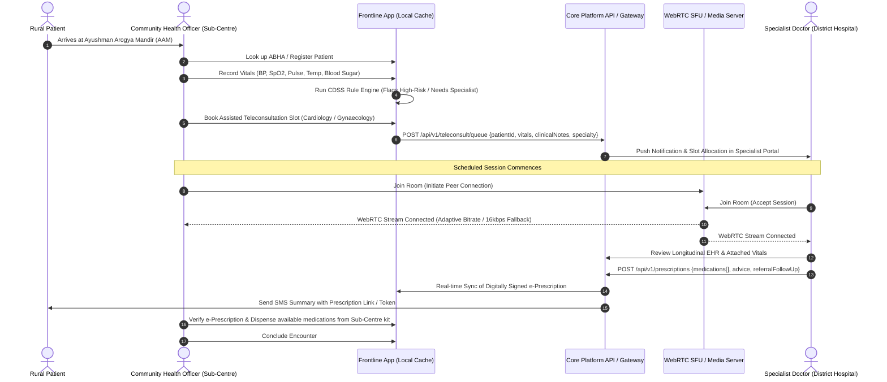
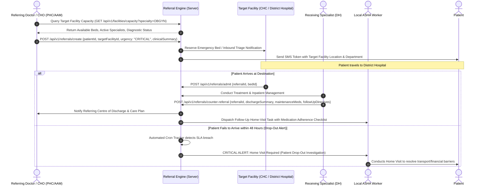
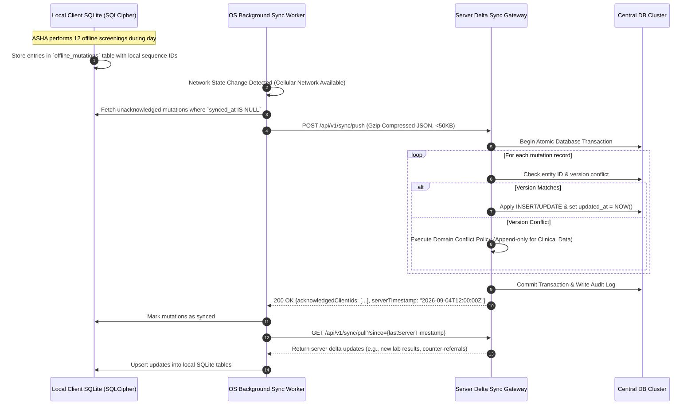
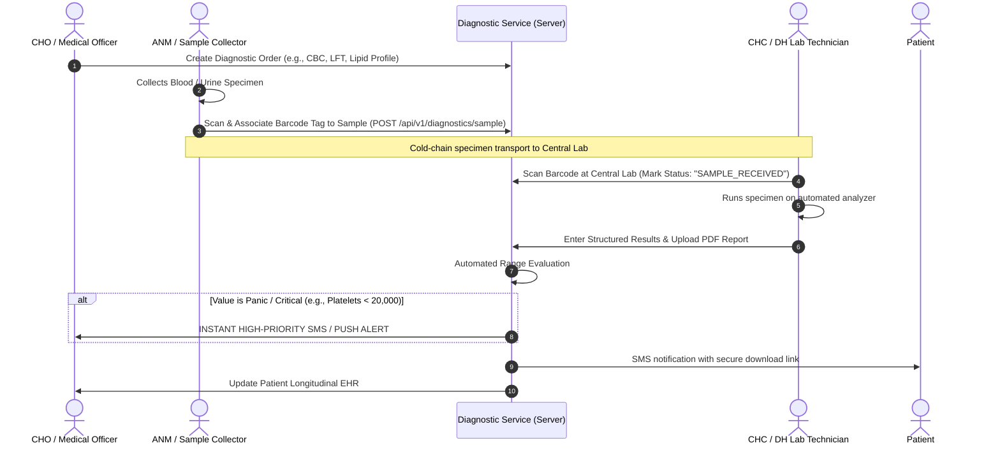
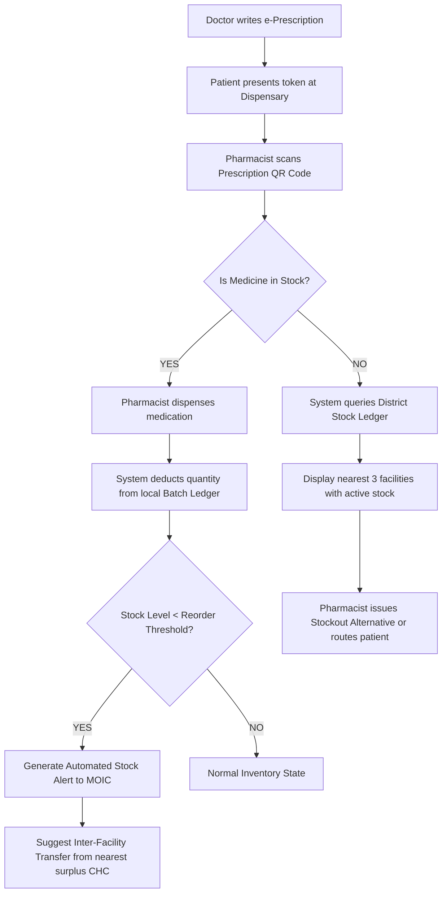
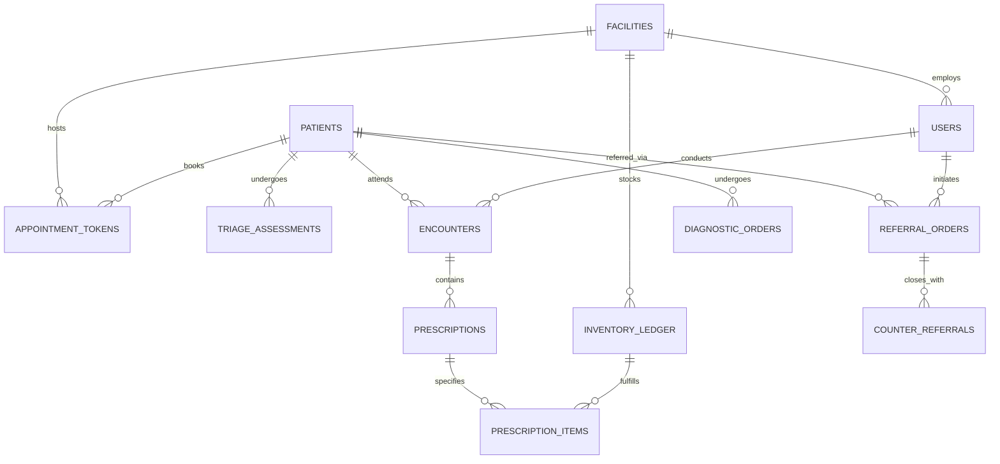

# Data Flow Specifications & Clinical Workflows: Rural Public Healthcare Platform

**Project Code:** SIH26133  
**Document Version:** 1.0.0  
**Status:** Workflow & Data Model Specification  

---

## 1. Core Clinical Workflows & Data Flows

### 1.1 Assisted Teleconsultation Workflow
This workflow bridges the specialist gap by enabling Community Health Officers (CHOs) or ASHAs at rural Sub-Centres to connect patients directly to remote specialists.



---

### 1.2 Closed-Loop Referral Workflow
The referral system eliminates "blind referrals" by maintaining end-to-end tracking, bed reservation, and two-way clinical feedback.



---

### 1.3 Offline-First Data Synchronization Handshake
Handles data consistency when frontline workers operate in network-dead zones.



---

### 1.4 Diagnostic Test Coordination Workflow
Connects primary sample collection points with centralized laboratories.



---

### 1.5 Essential Drug Inventory & Stock Visibility Flow
Prevents stockouts through real-time consumption logging and inter-facility stock sharing.



---

## 2. Core Data Models & Database Schemas

### 2.1 Entity Relationship Overview



---

### 2.2 Relational Schema Definitions (PostgreSQL 16)

#### Table: `patients`
```sql
CREATE TABLE patients (
    id UUID PRIMARY KEY DEFAULT gen_random_uuid(),
    abha_id VARCHAR(32) UNIQUE,
    first_name VARCHAR(100) NOT NULL,
    last_name VARCHAR(100) NOT NULL,
    date_of_birth DATE NOT NULL,
    gender VARCHAR(16) NOT NULL, -- 'MALE', 'FEMALE', 'OTHER'
    phone_number VARCHAR(15),
    emergency_contact_phone VARCHAR(15),
    address_village VARCHAR(150) NOT NULL,
    address_district VARCHAR(100) NOT NULL,
    address_state VARCHAR(100) NOT NULL,
    pincode VARCHAR(10) NOT NULL,
    geo_location GEOMETRY(Point, 4326),
    socio_economic_category VARCHAR(32), -- 'BPL', 'APL', 'ANTYODAYA'
    is_high_risk BOOLEAN DEFAULT FALSE,
    created_by UUID REFERENCES users(id),
    created_at TIMESTAMPTZ DEFAULT NOW(),
    updated_at TIMESTAMPTZ DEFAULT NOW(),
    version INT DEFAULT 1
);
CREATE INDEX idx_patients_abha ON patients(abha_id);
CREATE INDEX idx_patients_district ON patients(address_district);
CREATE INDEX idx_patients_high_risk ON patients(is_high_risk);
```

#### Table: `facilities`
```sql
CREATE TABLE facilities (
    id UUID PRIMARY KEY DEFAULT gen_random_uuid(),
    facility_code VARCHAR(32) UNIQUE NOT NULL, -- National NIN/NHA ID
    name VARCHAR(200) NOT NULL,
    facility_type VARCHAR(32) NOT NULL, -- 'SUB_CENTRE', 'PHC', 'CHC', 'DISTRICT_HOSPITAL', 'TERTIARY'
    district VARCHAR(100) NOT NULL,
    state VARCHAR(100) NOT NULL,
    geo_location GEOMETRY(Point, 4326) NOT NULL,
    total_beds INT DEFAULT 0,
    available_beds INT DEFAULT 0,
    has_icu BOOLEAN DEFAULT FALSE,
    has_blood_bank BOOLEAN DEFAULT FALSE,
    has_teleconsult_suite BOOLEAN DEFAULT TRUE,
    created_at TIMESTAMPTZ DEFAULT NOW()
);
CREATE INDEX idx_facilities_geo ON facilities USING GIST(geo_location);
```

#### Table: `triage_assessments`
```sql
CREATE TABLE triage_assessments (
    id UUID PRIMARY KEY DEFAULT gen_random_uuid(),
    patient_id UUID NOT NULL REFERENCES patients(id),
    assessed_by UUID NOT NULL REFERENCES users(id),
    facility_id UUID REFERENCES facilities(id),
    systolic_bp INT,
    diastolic_bp INT,
    heart_rate INT,
    spo2_percentage NUMERIC(4, 1),
    temperature_fahrenheit NUMERIC(4, 1),
    blood_glucose_mg_dl NUMERIC(5, 1),
    hemoglobin_g_dl NUMERIC(4, 1),
    muac_mm INT, -- Mid-Upper Arm Circumference for pediatric triage
    triage_category VARCHAR(32) NOT NULL, -- 'MATERNAL_HRP', 'PEDIATRIC_SAM', 'NCD_CARDIO', 'EMERGENCY_RED'
    severity_level VARCHAR(16) NOT NULL, -- 'RED', 'YELLOW', 'GREEN'
    rule_triggers JSONB NOT NULL, -- [{rule: "SEVERE_ANAEMIA", value: 6.8, threshold: 7.0}]
    assessed_at TIMESTAMPTZ NOT NULL,
    created_at TIMESTAMPTZ DEFAULT NOW()
);
CREATE INDEX idx_triage_severity ON triage_assessments(severity_level);
```

#### Table: `referral_orders`
```sql
CREATE TABLE referral_orders (
    id UUID PRIMARY KEY DEFAULT gen_random_uuid(),
    referral_code VARCHAR(32) UNIQUE NOT NULL,
    patient_id UUID NOT NULL REFERENCES patients(id),
    source_facility_id UUID NOT NULL REFERENCES facilities(id),
    target_facility_id UUID NOT NULL REFERENCES facilities(id),
    referring_doctor_id UUID NOT NULL REFERENCES users(id),
    specialty_required VARCHAR(64) NOT NULL, -- 'OBGYN', 'PAEDIATRICS', 'CARDIOLOGY', etc.
    urgency VARCHAR(16) NOT NULL, -- 'EMERGENCY', 'URGENT', 'ROUTINE'
    reason_for_referral TEXT NOT NULL,
    clinical_summary JSONB NOT NULL, -- Vitals snapshot, active conditions, allergies
    transport_mode VARCHAR(32), -- '108_AMBULANCE', 'PRIVATE', 'PUBLIC_BUS'
    status VARCHAR(32) NOT NULL, -- 'INITIATED', 'IN_TRANSIT', 'ARRIVED', 'DISCHARGED', 'CLOSED', 'DROPPED_OUT'
    initiated_at TIMESTAMPTZ DEFAULT NOW(),
    arrived_at TIMESTAMPTZ,
    discharged_at TIMESTAMPTZ,
    sla_breach_alert_sent BOOLEAN DEFAULT FALSE
);
CREATE INDEX idx_referrals_status ON referral_orders(status);
CREATE INDEX idx_referrals_target ON referral_orders(target_facility_id);
```

#### Table: `counter_referrals`
```sql
CREATE TABLE counter_referrals (
    id UUID PRIMARY KEY DEFAULT gen_random_uuid(),
    referral_id UUID UNIQUE NOT NULL REFERENCES referral_orders(id),
    attending_specialist_id UUID NOT NULL REFERENCES users(id),
    final_diagnosis TEXT NOT NULL,
    icd10_codes TEXT[],
    treatment_given TEXT NOT NULL,
    post_discharge_plan TEXT NOT NULL,
    follow_up_instructions TEXT NOT NULL,
    created_at TIMESTAMPTZ DEFAULT NOW()
);
```

#### Table: `inventory_ledger`
```sql
CREATE TABLE inventory_ledger (
    id UUID PRIMARY KEY DEFAULT gen_random_uuid(),
    facility_id UUID NOT NULL REFERENCES facilities(id),
    medicine_name VARCHAR(200) NOT NULL,
    composition VARCHAR(200) NOT NULL,
    dosage_form VARCHAR(64) NOT NULL, -- 'TABLET', 'SYRUP', 'INJECTION', etc.
    batch_number VARCHAR(64) NOT NULL,
    quantity_in_stock INT NOT NULL CHECK (quantity_in_stock >= 0),
    reorder_level INT NOT NULL,
    expiry_date DATE NOT NULL,
    last_restocked_at TIMESTAMPTZ,
    updated_at TIMESTAMPTZ DEFAULT NOW(),
    UNIQUE(facility_id, batch_number, medicine_name)
);
CREATE INDEX idx_inventory_lookup ON inventory_ledger(facility_id, medicine_name);
```

---

## 3. Data Payloads & Protocol Specifications

### 3.1 Delta Sync Push Request (Mobile to Sync Gateway)
```json
{
  "clientId": "ASHA-DEV-9842",
  "clientSyncSequence": 1042,
  "appVersion": "1.4.2",
  "mutations": [
    {
      "mutationId": "c4b12d59-8802-4d2a-89a1-f3496030b2e8",
      "entityType": "triage_assessments",
      "action": "INSERT",
      "timestamp": "2026-09-04T05:30:12Z",
      "payload": {
        "patientId": "e1432f80-06cb-4b77-84bc-7c3fa1098e91",
        "systolicBp": 146,
        "diastolicBp": 94,
        "hemoglobin": 6.8,
        "severityLevel": "RED",
        "triageCategory": "MATERNAL_HRP"
      }
    }
  ]
}
```

### 3.2 WebRTC Signaling Message (Signaling Channel via WebSocket)
```json
{
  "type": "RTC_SIGNAL",
  "sessionId": "tc-sess-88912",
  "fromUserId": "cho-user-12",
  "toUserId": "doc-spec-04",
  "signal": {
    "type": "offer",
    "sdp": "v=0\r\no=- 4212984 2 IN IP4 127.0.0.1\r\ns=-\r\nt=0 0\r\na=group:BUNDLE 0 1..."
  },
  "bandwidthProfile": "LOW_BANDWIDTH_VOICE_PRIORITY"
}
```
