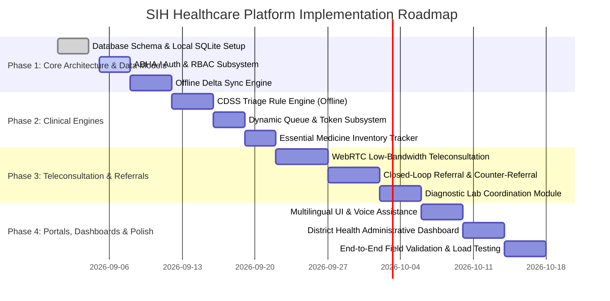

# Feature Scope & Prioritization Matrix (MoSCoW): Rural Public Healthcare Platform

**Project Code:** SIH26133  
**Document Version:** 1.0.0  
**Status:** Feature Scope Specification  

---

## 1. Scope Prioritization Methodology

To ensure immediate delivery of an impactful, fully functional minimum viable product (MVP) for the Smart India Hackathon (SIH) while maintaining a production-ready roadmap, features are prioritized using the **MoSCoW Framework**:
* **MUST HAVE (P0):** Mission-critical features without which the system cannot solve the core problem of rural healthcare accessibility and coordination. Forms the core SIH hackathon evaluation deliverables.
* **SHOULD HAVE (P1):** High-value features that significantly enhance clinical safety, operational automation, and user convenience; target for pilot deployment.
* **COULD HAVE (P2):** Advanced innovation capabilities (AI computer vision, IoT telemetry) to be deployed once core infrastructure stabilizes.
* **WON'T HAVE / OUT OF SCOPE (P3):** Features deliberately excluded to prevent scope creep and maintain architectural focus.

---

## 2. Detailed MoSCoW Breakdown

```
+-----------------------------------------------------------------------------------+
|                                  FEATURE SCOPE                                    |
+------------------------------------------+----------------------------------------+
| MUST HAVE (P0 - MVP / Hackathon Core)    | SHOULD HAVE (P1 - Pilot Deployment)    |
| • Offline-first ASHA/CHO app             | • Automated Vernacular IVR calling     |
| • Deterministic CDSS triage engine       | • AI-assisted OCR of paper lab slips   |
| • Assisted teleconsultation (WebRTC)     | • GIS disease outbreak heatmaps        |
| • Closed-loop 2-way referral engine      | • GPS-linked 108 ambulance tracking    |
| • Dynamic OPD queue & SMS tokens         | • Barcode scanning for specimen transit|
| • Essential medicine stock visibility    | • WhatsApp chatbot for patient records |
| • ABHA / FHIR R4 longitudinal EHR        +----------------------------------------+
| • Indic multilingual UI (Hindi/English)  | COULD HAVE (P2 - Advanced R&D)         |
| • Delta sync engine (<50KB payloads)     | • Chest X-Ray AI screening (TB)        |
| • District health admin dashboard        | • Drone transport integration          |
+------------------------------------------+ • Bluetooth BLE vital sensor auto-sync |
| WON'T HAVE (P3 - Out of Scope)                                                    |
| • Hospital ERP (billing, payroll, laundry) | Direct commercial pharmacy e-commerce |
| • Autonomous AI diagnosis replacing doctors| Proprietary non-standard EHR formats  |
+-----------------------------------------------------------------------------------+
```

---

## 3. Detailed Specification by Priority Tier

### 3.1 MUST-HAVE Features (P0 — SIH Core MVP)

#### 1. Offline-First Frontline Worker Module (ASHA / ANM / CHO)
* **Description:** Standalone Android / PWA client capable of registering patients, capturing vitals, and logging maternal/NCD health checks without internet connectivity.
* **Key Capabilities:**
  * Local encrypted SQLite storage.
  * Deterministic background sync worker with retry backoff.
  * Delta sync packaging (<50KB batch size).

#### 2. Clinical Decision Support System (CDSS) for High-Risk Triage
* **Description:** Pre-compiled deterministic rule trees running directly on device.
* **Key Capabilities:**
  * Evaluates High-Risk Pregnancy (HRP) indicators: severe anaemia (Hb < 7), pre-eclampsia (BP ≥ 140/90), gestational diabetes.
  * Child screening: Severe Acute Malnutrition (SAM via MUAC < 115mm), respiratory distress.
  * Color-coded triage tagging: Red (Emergency), Yellow (Urgent Specialist Review), Green (Primary Routine).

#### 3. Assisted & Direct Teleconsultation Module
* **Description:** WebRTC-powered low-bandwidth teleconsultation bridging rural sub-centres with hospital doctors.
* **Key Capabilities:**
  * Peer-to-peer and SFU video/audio calling.
  * Dynamic fallback to ultra-low bitrate audio (16 kbps Opus) when packet loss occurs.
  * Store-and-forward fallback: CHO uploads patient clinical snapshot and audio note for asynchronous specialist review.
  * Generation of tamper-evident, digitally signed electronic prescriptions.

#### 4. Closed-Loop Inter-Facility Referral Management
* **Description:** Real-time transfer coordinator across primary, secondary, and tertiary health tiers.
* **Key Capabilities:**
  * Pre-referral target hospital capacity check (specialist availability, bed availability).
  * Structured electronic referral transfer bundle with patient clinical history.
  * Target facility acknowledgement and triage reservation.
  * **Mandatory Counter-Referral Note:** Receiving specialist submits discharge summary and rehabilitation instructions routed back to local ASHA/CHO.
  * 48-hour referral drop-out tracker alerting frontline workers to conduct physical trace visits.

#### 5. Smart Dynamic Queue & Token Management
* **Description:** Automated queue coordination eliminating hours of physical crowding at PHCs and District Hospitals.
* **Key Capabilities:**
  * Digital token generation via app or assisted health worker.
  * Priority token injection for emergency red-flagged referrals.
  * Dynamic estimated wait-time calculation.
  * SMS token alerts notifying patient when their turn is approaching.

#### 6. Essential Drug Availability & Multi-Tier Stock Visibility
* **Description:** Inventory tracker connecting dispensaries across sub-centres, PHCs, CHCs, and District Hospitals.
* **Key Capabilities:**
  * Real-time batch-level stock deductions upon e-prescription dispensing.
  * Inter-facility stock queries allowing a rural doctor to identify nearby facilities with available medicine in case of local stockouts.
  * Threshold alerts when essential stock falls below 7 days of consumption.

#### 7. Longitudinal Electronic Health Record (EHR) & ABHA Integration
* **Description:** Unified patient timeline adhering to national standards.
* **Key Capabilities:**
  * ABHA ID generation / linking via mobile or Aadhaar OTP.
  * Standardized HL7 FHIR R4 schema mapping (Patient, Encounter, Observation, Condition).
  * Role-based, consent-driven record viewing across all public health tiers.

#### 8. Multilingual & Low-Literacy User Interface
* **Description:** Culturally tailored interface for rural citizens and frontline workers.
* **Key Capabilities:**
  * Full localization in English, Hindi, and regional languages.
  * Text-to-Speech (TTS) readout of prescriptions and instructions.
  * Universal, high-contrast iconography and audio feedback for illiterate patients.

#### 9. Healthcare Facility & District Administrative Dashboard
* **Description:** Command-centre analytics for CMOs, Medical Superintendents, and NHM directors.
* **Key Capabilities:**
  * Operational KPI tracking: average OPD wait times, teleconsultation resolution rates, referral completion percentages.
  * Facility readiness metrics: doctor presence, drug stockout alerts.

---

### 3.2 SHOULD-HAVE Features (P1 — Pilot Deployment)
* **Automated Vernacular IVR Calling:** Automated interactive voice response phone calls in regional languages to remind elderly and illiterate patients of upcoming medication refills and clinic dates.
* **AI-Assisted OCR for Lab Slips:** Optical Character Recognition allowing ANMs to photograph paper lab reports and automatically populate structured numeric values into the digital EHR.
* **GIS Epidemiological Outbreak Surveillance:** Interactive maps correlating symptoms logged by ASHAs to pinpoint early disease outbreak clusters (e.g., cholera, dengue, malaria).
* **GPS-Linked 108 Emergency Ambulance Coordination:** Live coordination with state emergency medical services to dispatch ambulances for red-flagged critical referrals.
* **Barcode Specimen Transit Tracking:** Scanning sample vials during transport between Sub-Centres and central CHC diagnostic labs.
* **WhatsApp / SMS Chatbot for Patients:** Lightweight messaging interface allowing citizens to download prescriptions and check queue status without installing an application.

---

### 3.3 COULD-HAVE Features (P2 — Advanced R&D)
* **AI Computer Vision Radiography (TB Screening):** Edge-deployed lightweight deep learning models assisting rural doctors in screening chest X-rays for pulmonary tuberculosis.
* **Drone-Based Emergency Medicine Transit Tracking:** Status dashboard for autonomous medical drones transporting antivenom and emergency blood supplies to cutoff tribal locations.
* **Bluetooth BLE Medical Device Auto-Sync:** Automated vital capture pairing wireless digital BP monitors, pulse oximeters, and glucometers directly to the CHO tablet.

---

### 3.4 WON'T-HAVE / OUT-OF-SCOPE (P3)
* **Hospital Enterprise ERP Modules:** Billing engines, insurance claim reimbursement systems, staff payroll, laundry/canteen management. (The platform strictly focuses on clinical accessibility, referral coordination, and healthcare delivery quality).
* **Autonomous AI Physician Replacement:** The platform does not issue autonomous medical diagnoses without doctor oversight; CDSS is strictly assistive triage.
* **Direct Commercial Medicine Sales:** No commercial e-pharmacy or private vendor marketplaces; strictly public health essential drug supply chains.
* **Proprietary Non-Standard Data Formats:** Proprietary schemas without FHIR/ABDM compatibility are prohibited.

---

## 4. Release Roadmap & Implementation Milestones



---

## 5. Summary Alignment with SIH Problem Statement

| Problem Statement Objective | Platform Architectural Component | Feature Priority |
| :--- | :--- | :---: |
| **Limited access to specialist doctors** | Assisted Teleconsultation (Store-and-Forward + WebRTC) | **P0 (Must Have)** |
| **Long travel distances & delayed care** | Pre-triage at Sub-Centres, Teleconsultations, Tele-diagnostics | **P0 (Must Have)** |
| **Overcrowding & inefficient queue management** | Smart Dynamic Queue & Token Management with priority bypass | **P0 (Must Have)** |
| **Delayed & blind referrals** | Closed-Loop Two-Way Referral System with counter-referral loop | **P0 (Must Have)** |
| **Fragmented patient records** | Longitudinal FHIR R4 EHR with ABHA integration | **P0 (Must Have)** |
| **Irregular diagnostic services** | Diagnostic sample collection tracking & digital report delivery | **P0 (Must Have)** |
| **Tracking high-risk patients** | Offline CDSS Triage & ASHA automated follow-up worklists | **P0 (Must Have)** |
| **Limited visibility of medicine availability** | Multi-tier dispensary inventory tracker with stockout alerts | **P0 (Must Have)** |
| **Poor inter-facility coordination** | Inter-facility bed/specialist registry & referral state machine | **P0 (Must Have)** |
| **Rural low-connectivity operation** | Local-first encrypted SQLite database & delta sync gateway | **P0 (Must Have)** |
| **Multilingual rural accessibility** | Indic localization (Hindi/English/Regional) + Voice assistance | **P0 (Must Have)** |
